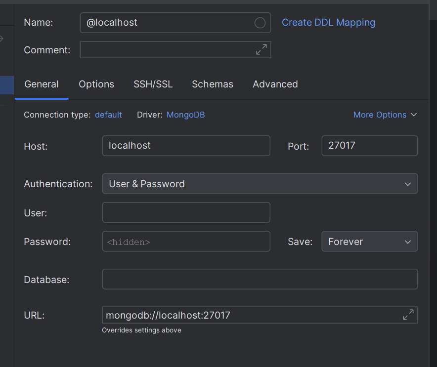
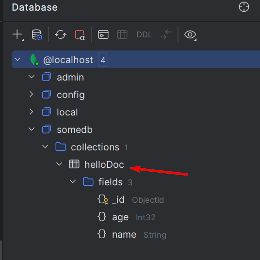
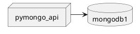
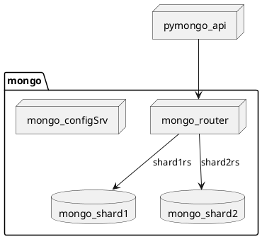

# Ревизия

## Подключаемся к БД с внешними редакторами

Для подключения используется плагин pycharm для работы с БД

Для подключения к БД необходимо пробросить порт наружу.
Для этого в сервис mongodb1 добавляется проброс портов

```
    ports:
      - 27017:27017
```



### Заполнение данными
Для заполнения данными необходимо было выполнить скрипт с ../scripts/mongo-init.sh

Можно выполнить в терминале

Запустить сессию к mongodb
```shell
docker exec -it mongodb1 mongosh --port 27017
```

Подключаемся к БД
```
use somedb
```
Исполняем цикл заполнения данными
```
for(var i=0;i<1000;i++) db.helloDoc.insertOne({age:i, name: "ly"+i})
```

### Контроль 
Выполнить в консоли терминала
```
db.getSiblingDB("somedb").getCollection("helloDoc").find()
```

Как вариант можно подключиться в плагине pycharm и найти необходимую коллекцию



## Шардирование

Текущая схема


Для шардирования удаляется сервис mongodb1 и вместо него создается кластер mongodb с шардированием
- mongo_configSrv - конфигурационный сервер ip 177.17.0.10 port 27017
- mongo_shard1 - Шард1 монго. ip 177.17.0.9 port 27018
- mongo_shard2 - Шард2 монго. ip 177.17.0.8 port 27019
- mongo_router - Роутер для шардирования. ip 177.17.0.7 port 27020


В каталоге mongo-sharding находится 
- compose.yaml - docker-compose файл для сборки шардирования
- readme.md - описана последовательность разворачивания
- ./scripts/* - добавлены файлы для инициализации сервисов и заполнения данными.

Обращаю внимание: по умолчанию во всех сервисах оставлен порт 27017 (чтобы в mongosh исполmзовать порт по умолчанию)

Для доступа снаружи произведен проброс портов
+ config_srv 27017 -> 27017 
+ mongo_shard1 27017 -> 27018
+ mongo_shard2 27017 -> 27019
+ mongos_router 27017 -> 27020
+ pymongo_api 8080 -> 8080

Для контроля использовался доступ к БД для понимания раскидывания записей по разным шардам.

Для контроля работы api использовался http://localhost:8080/docs

## Репликация
Рабочие файлы помещены в mongo-sharding-repl

Разворачиваем все сервисы в докере
Проходим по всем скриптам в readme для заполнения данными

Подключаемся к primary реплике (shard*a) и получаем количество документов в реплике
```
use somedb
db.helloDoc.countDocuments()
```
Убеждаемся, что документы есть и  их количество не 1000. 
Проверяем, по secondary репликам (shard*b, shard*c), что количество документов соотвествует primary реплике.

Проверяем, что количество документов shard1c + shard2b равно 1000 (количеству созданных документов)

## Кэширование 
Добавляем одну ноду redis
Добавляем переменную подключения кэширования REDIS_URL

Дополнительно, для контроля можно установить утилиту для контроля содержимого redis

Через swagger - запрашиваем http://localhost:8080/docs#/default/list_users__collection_name__users_get
количество документов в коллекции helloDoc

При этом при первом запуске время исполнения должно быть большим, при повторном значительно снизиться.
Контроллировать можно через логи сервиса pymongo_api

```
{"asctime": "2025-05-12 04:06:16,720", "process": 1, "levelname": "INFO", 
"X-API-REQUEST-ID": "4800287c-0235-492f-aabe-f4f0f8172bd9",
 "request": {"method": "GET", "path": "/helloDoc/users", "ip": "172.26.0.1"}, 
 "response": {"status": "successful", "status_code": 200, "time_taken": "1.0521s"}, "taskName": "Task-8"}


{"asctime": "2025-05-12 04:06:35,107", "process": 1, "levelname": "INFO", 
"X-API-REQUEST-ID": "05953bdb-a575-4208-bab4-9804f9f10b49", 
"request": {"method": "GET", "path": "/helloDoc/users", "ip": "172.26.0.1"}, 
"response": {"status": "successful", "status_code": 200, "time_taken": "0.0153s"}, "taskName": "Task-13"}
```

В данном случае /response/time_taken в первом случае давал результат 1.05с, во втором 0.0153c
Дополнительно можно проконтролировать в утилите работы с redis, что данные закешировались.

При текущих подключениях ключ будет находиться по пути db0/api/cache/1 